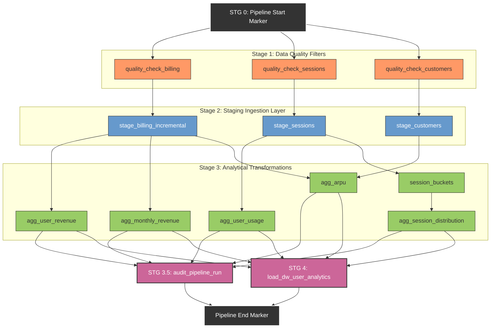

# DataTel Communications — Data Pipeline
### AltSchool Data Engineering Capstone Project
Overview

An end-to-end batch data engineering pipeline for a telecommunications company that ingests customer, billing, and network session data from PostgreSQL, performs data quality validation, transforms the data into business metrics, and loads analytics-ready data into BigQuery.

---

## Business Context & Core Systems
DataTel collects massive volumes of daily event telemetry across isolated production zones, each presenting distinct data quality challenges (missing values, text-formatted timestamps, and duplicate retry errors):
* **Billing System (Transactional):** Captures every financial transaction, invoice, and customer payment stream.
* **Network System (Event Logs):** Streams high-volume data session telemetry, including session durations and megabyte (MB) consumption.
* **CRM System (Master Data):** Maintains the source-of-truth registry for customer profiles and account lifecycles.

---


## Tech Stack


-Python
-Apache Airflow
-PostgreSQL
-Google Cloud Storage (GCS)
-Google BigQuery
-Docker
-SQL


---

## Project Structure

```
telecom_pipeline_project/

├── dags/
│   └── datatel_pipeline_dag.py
│
├── sql/
│   ├── data_quality_checks/
│   │   ├── check_and_quarantine_billing.sql
│   │   ├── check_and_quarantine_customers.sql
│   │   └── check_and_quarantine_sessions.sql
│   │
│   ├── staging/
│   │   ├── stg_customers.sql
│   │   └── stg_network_sessions.sql
│   │
│   ├── incremental/
│   │   └── incremental_billing.sql
│   │
│   ├── transformation/
│   │   ├── agg_user_revenue.sql
│   │   ├── agg_monthly_revenue.sql
│   │   ├── agg_user_usage.sql
│   │   ├── session_buckets.sql
│   │   ├── agg_session_distribution.sql
│   │   └── agg_arpu.sql
│   │
│   └── warehouse/
│       └── dw_user_analytics.sql
│
├── docker-compose.yaml
├── requirements.txt
└── README.md
```

---

##  Directed Acyclic Graph (DAG) Topology

The pipeline orchestrates tasks concurrently using clear data domain boundaries. Stage 1 quality check gates must succeed before data is promoted into Stage 2 Staging tables, protecting downstream analytical layers from corruption.


---

###  DAG Architecture Highlights

* **Isolated Failure Blocker**: If the raw transactional billing files fail their quality test (`quality_check_billing`), only the `stage_billing_incremental` branch is frozen. The customer master data and network logs branches will continue validating and loading in parallel, preventing a single system error from bottlenecking the entire infrastructure.
* **Strict Source-Domain Mapping**: Transformation tasks execute based strictly on their target data domains. Usage queries wait specifically for network session staging tables to commit, while revenue and ARPU metrics process concurrently the moment financial billing rows are securely loaded.
* **Consolidated Synchronization**: The final analytical warehouse view load (`load_dw_user_analytics`) and operational auditing logs act as synchronization barriers. They require all upstream transformation states to conclude successfully before running final upserts.


---

## Installation & Execution Guide

This pipeline operates on a hybridized architecture: an automated Docker Compose environment orchestrating a containerized Airflow scheduler, communicating directly with a bare-metal local PostgreSQL instance on the host machine, and syncing to a cloud-native Google BigQuery warehouse.

### Prerequisites
* **Docker Desktop** installed with Linux Containers enabled.
* **PostgreSQL** installed locally on your host machine (running on port `5432`).
* A **Google Cloud Platform (GCP)** account with an active project and an enabled BigQuery API.

---

### Step 1: Clone and Configure the Project environment

1. Clone this repository to your local directory:
   ```bash
   git clone https://github.com
   cd YOUR_REPOSITORY_NAME
   ```

2. Create a `.env` file in the project root folder to configure your database connection parameters and local data directories:
   ```env
   # PostgreSQL Ingestion Settings (Windows Host Instance)
   POSTGRES_HOST=localhost
   POSTGRES_PORT=5432
   POSTGRES_DB=datatel_com
   POSTGRES_USER=postgres
   POSTGRES_PASSWORD=YOUR_SECURE_PASSWORD

   # Local Data Directory
   CSV_DIR=C:/Users/YOUR_USER/PATH_TO_PROJECT/data
   ```

---

### Step 2: Seed the Operational Source Data

1. Place your generated CSV files (`src_customers.csv`, `src_billing_transactions.csv`, `src_network_sessions.csv`) into the directory defined in your `CSV_DIR` environment path.
2. Execute your Python ingestion script from your host terminal to build your landing zone and seed millions of source records into PostgreSQL:
   ```bash
   python scripts/load_csv_to_postgres.py
   ```
3. Open **pgAdmin**, connect to your `datatel_com` database, and run a query tool verification block to check your operational row status counts.

---

### Step 3: Initialize and Launch the Airflow Stack

1. Spin up the containerized multi-node Airflow stack using Docker Compose:
   ```bash
   docker compose up -d --build
   ```

2. Verify that all components (Scheduler, Webserver, Triggerer, Redis background broker) are operating in a healthy state:
   ```bash
   docker ps
   ```

---

### Step 4: Configure Airflow Connections & Meta-Data

To enable your containerized scheduler to securely connect to your bare-metal host machine and Google Cloud project instances, inject the configuration parameters directly from your console terminal:

1. Create a network bridge connection routing the container's relational database operator directly to your Windows host machine:
   ```bash
   docker compose exec airflow-scheduler airflow connections add 'postgres_datatel' \
       --conn-type 'postgres' \
       --conn-host 'host.docker.internal' \
       --conn-login 'postgres' \
       --conn-password 'YOUR_SECURE_PASSWORD' \
       --conn-schema 'datatel_com' \
       --conn-port 5432
   ```

2. Configure a connection template parameter pointing to your target cloud environment:
   ```bash
   docker compose exec airflow-scheduler airflow connections add 'bigquery_default' \
       --conn-type 'google_cloud_platform'
   ```

---

###  Step 5: Execute and Test the End-to-End Pipeline

1. Trigger a local validation test inside the container environment to verify execution tracking across your quality gates and transformation steps:
   ```bash
   docker compose exec airflow-scheduler airflow dags test datatel_pipeline 2024-01-01
   ```

2. Alternatively, access the graphical interface dashboard by navigating to your browser at `http://localhost:8080`. Log in using your configured admin credentials, toggle the **`datatel_pipeline`** slider switch to active, and hit the **Trigger DAG** button to track execution telemetry in real-time.


##  Core Business Use Cases Solved

The data warehouse successfully consolidates multi-source silos to power three critical business domains (Full query code available in `sql/warehouse/dw_user_analytics.sql`):
* **Customer Analytics**: Profiles high-value users by mapping total revenue generation directly against network data consumption volume.
* **Churn Risk Detection**: Automatically flags inactive accounts showing a simultaneous drop-off in billing transactions and data sessions.
* **Revenue Operations (RevOps)**: Audits financial leakages by surfacing accounts consuming critical network bands without corresponding payments.
